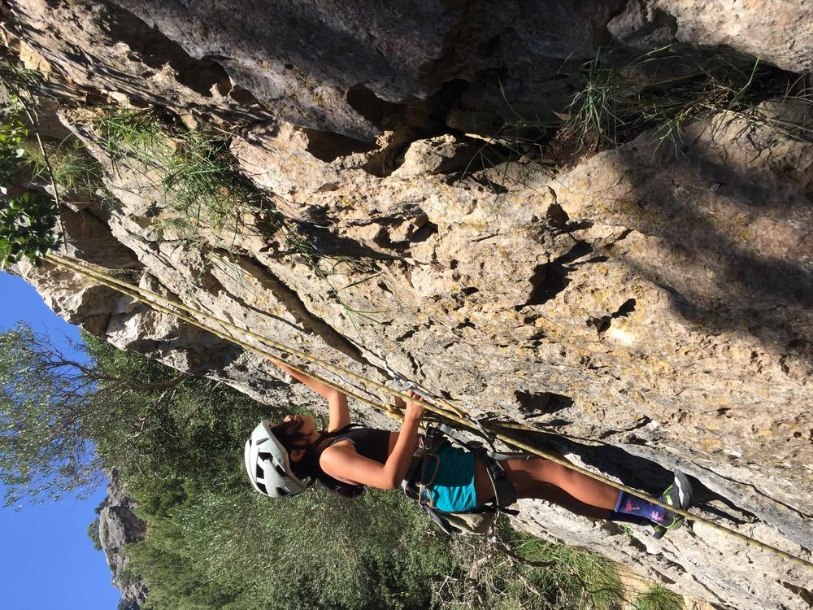

*Para ella, ¡una experiencia inolvidable!*

## Bautismo de escalada

Los bautizos tienen la magia de descubrir ¡una nueva actividad!

Me encanta acompañar en "la primera vez", ayudar a guardar los mejores recuerdos, tanto en la memoria como con fotos.

Trae el material básico (gatos y arnés) y yo te llevo a dar tus primeros pasos en roca natural. Si has practicado días o meses en rocódromo o si no has escalado nunca, disfrutarás superando los nuevos retos de buscar los agarres de manos y apoyos de pies. Yo me encargo de las cuerdas, la seguridad y animarte a llegar arriba.

¿Preparad@s para probar?

* * *

### Detalles de la actividad: 
👥 Tamaño del grupo: 2-4 amig@s, familiares o compañer@s de trabajo, ¿por qué no? 😉

⏳ Duración aproximada: 3-4h, una mañana o una tarde

*	📅 Acordaremos la fecha que mejor nos viene
*	🎒 Os informaré del material necesario
*	🅿️ Enviaré la ubicación del parking donde nos encontraremos

### Ejemplos: 
s'Estret, Can Fil, Caimari, Puig de San Martí, Cas Català
