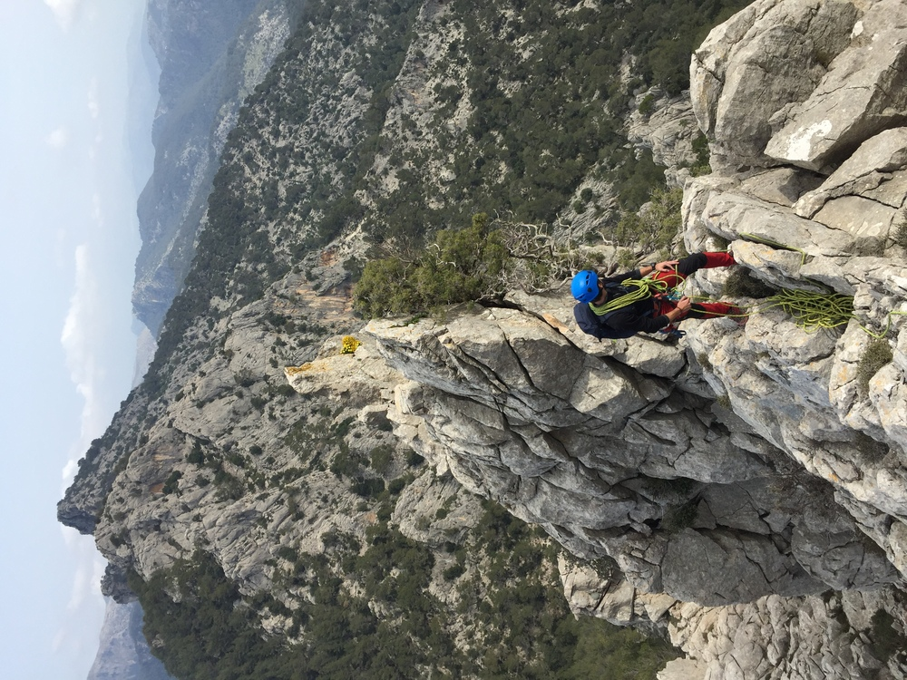

*Vistas espectaculares en las crestas*

## Cresta
Aunque Mallorca sea famosa por la escalada, ofrece crestas bastante atractivas.

Ofrezco desde crestas sencillas con algunas trepadas hasta itinerarios más verticales y ¡mucha sensación de vacío!

Desde que vivo en Mallorca he tenido poca oportunidad de guiar crestas, pero, a nivel personal, he recorrido más de 40 crestas en Alpes, Pirineos y otras montañas de la península.

* * *

### Una actividad típica: 
📍 Ejemplos: La Crestina en Sa Gubia, Aresta Llarga de Son Nassi, Aresta de n'Ali, Son Torrella

👥 Nº de clientes: ¡Exclusivamente para un cliente!

⏳ Duración aproximada: 5-7h, bastante variable
