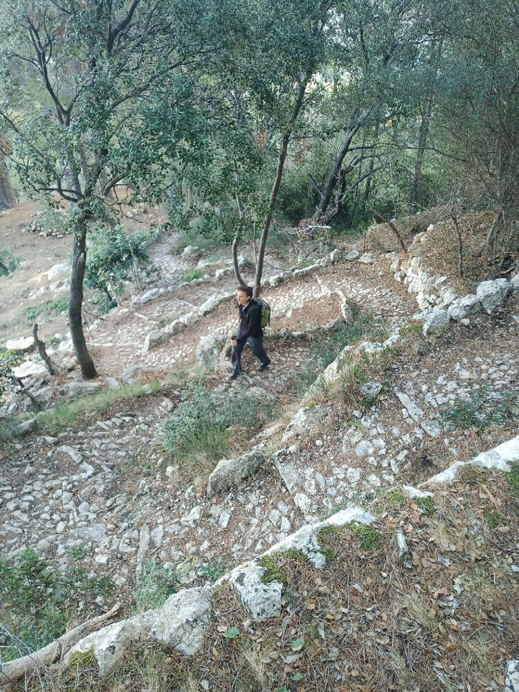

*De paseo por Sòller*

## Senderismo sencillo

*   ¿Acabas de llegar a la isla y quieres conocer lugares con encanto?
*   ¿Tienes a alguien a quien sorprender?
*   ¿Llevas años en la isla y se te han acabado las excursiones nuevas?

Habla con tus amig@s, ¡nos vamos de excursión!

* * *

### Detalles de la actividad: 
👥 Tamaño del grupo: 4 personas (ampliable hasta 20 personas)

⏳ Duración aproximada: 4-5h, una mañana o una tarde (ampliable)

*	📅 Acordaremos la fecha que mejor os viene
*	🎒 Os informaré del material necesario
*	🅿️ Enviaré la ubicación del parking donde nos encontraremos

### Ejemplos: 
Comuna de Bunyola, Camí des Correu, entorno de Lluc, zona Deia-Sóller, Escoltes, Arxiduc, Biniaraix, Talaia de Alcudia, picos sencillos
