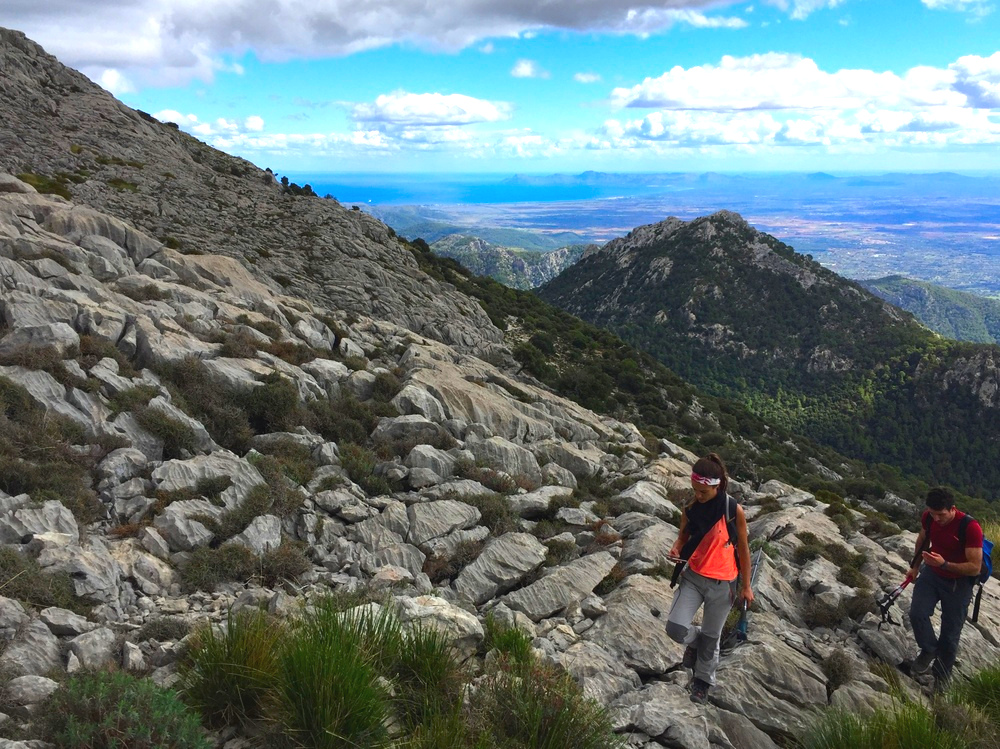

*Terreno técnico al Massanella*

## Senderismo técnico

Una actividad para senderistas habituales. Gente que disfruta de caminar por encinares, entre carritx y los penyales de la isla. Pero quizá no te sientes cómod@ con los mapas, los senderos estrechos, cuando no encuentras la siguiente fita o marca de la ruta. ¡Me encantará acompañaros en vuestra próxima excursión!

¿¡Quieres subir caminando a todos los miles de Mallorca!?

* * *

### Detalles de la actividad: 
👥 Tamaño del grupo: 4 personas (ampliable hasta 10 personas)

⏳ Duración aproximada: 5-7h, bastante variable (ampliable)

*	📅 Acordaremos la fecha que mejor os viene
*	🎒 Os informaré del material necesario
*	🅿️ Enviaré la ubicación del parking donde nos encontraremos

### Ejemplos: 
Torrent de Pareis, picos técnicos (Galatzó, Massanella, Tomir…)
