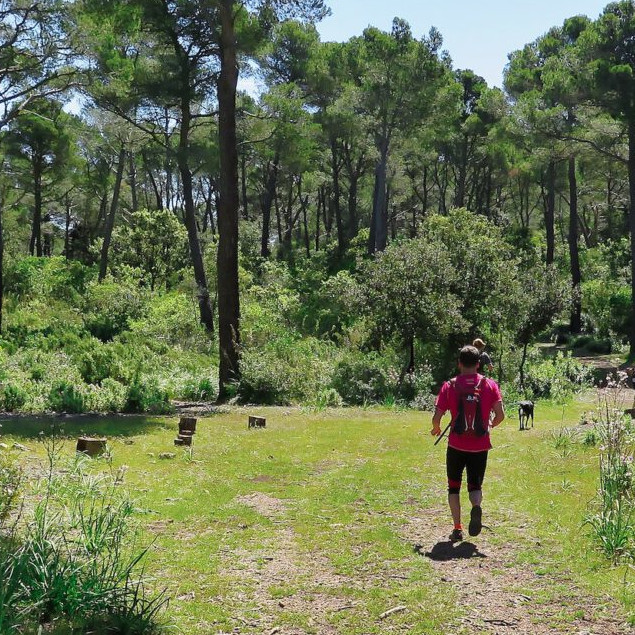

*¡Un entrenamiento disfrutón!*

## Trail running

Salir a correr por montaña no es una locura, se pueden adaptar los recorridos, distancias y desniveles. Quizá lleves años caminando por Tramuntana y viendo corredor@s disfrutar trotando por los senderos y te ha llegado el momento...

...de ¡ponerte las zapatillas! 🏃🏻

* * *

### Detalles de la actividad: 
👥 Tamaño del grupo: 1 persona (ampliable a 2 personas)

⏳ Duración aproximada: 1-2h (ampliable)

*	📅 Acordaremos la fecha que mejor te viene
*	🎒 Te informaré del material necesario
*	🅿️ Enviaré la ubicación del parking donde nos encontraremos

### Ejemplos: 
Comuna de Bunyola, de Esporles, Cases de Galatzó, zona de Cúber...
