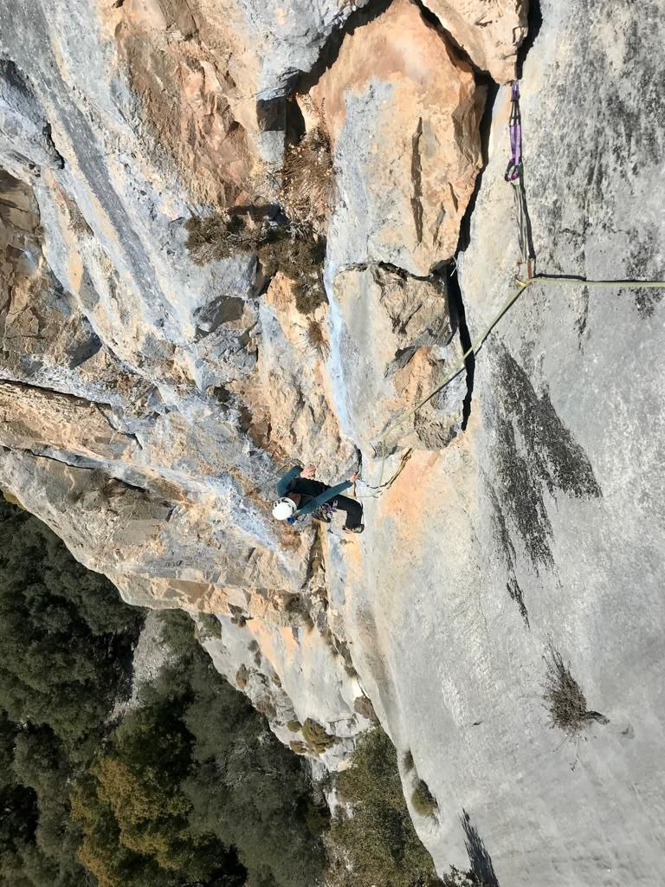

*Las fisuras son emplazamientos perfectos*

## Vía larga clásica
L@s montañer@s somos grandes amantes de la naturaleza e intentamos disfrutar de ella sin perturbar su equilibrio, dejando el mínimo rastro posible.

Te invito a escalar una pared de roca en la que apenas encontraremos unos pocos anclajes donde tomar un respiro y disfrutar de las vistas. El resto del recorrido lo protegeré con protecciones que tú irás recogiendo para dejar la roca ¡tal y como la encontramos!

¿Me acompañas?

* * *

### Detalles de la actividad: 
👥 Tamaño del grupo: 1 persona (ampliable a 2 personas)

⏳ Duración aproximada: 5-7h, bastante variable

*	📅 Acordaremos la fecha que mejor te viene
*	🎒 Te informaré del material necesario
*	🅿️ Enviaré la ubicación del parking donde nos encontraremos

### Ejemplos: 
Albahida, Esperó des Plà, Agulla des Frare, Pepe Ramón, Rectal
