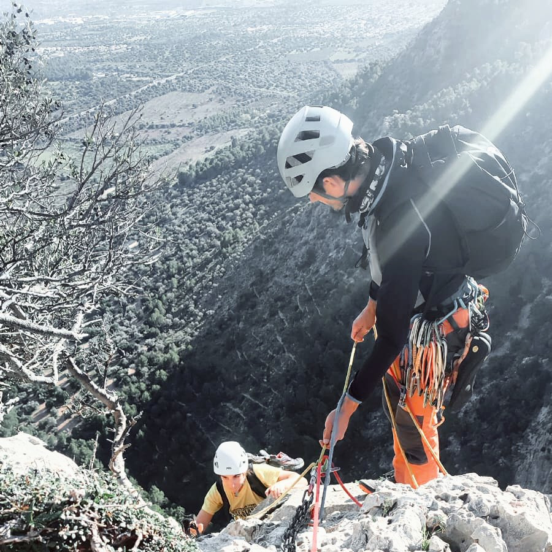

*Tras metros y metros 🧗🏻‍♀️ ¡cumbre!*

## Vía larga equipada

Escalas deportiva habitualmente y sueñas con continuar escalando hacia arriba 30m, 40, 50... ¿100m? ¿150m? ¡Entonces compartimos pasión!

Escalar una vía larga es todo una experiencia. Sentir cómo vas alejándote del suelo, reunirte con tu guía tras cada largo, seguir escalando y llegar a lo más alto para luego rapelar hasta el suelo por nuestros propios medios.

¡Imagínate las fotos que salen desde allí arriba!

* * *

### Detalles de la actividad: 
👥 Tamaño del grupo: 1 persona (ampliable a 2 personas)

⏳ Duración aproximada: 5h, una mañana o una tarde

*	📅 Acordaremos la fecha que mejor te viene
*	🎒 Te informaré del material necesario
*	🅿️ Enviaré la ubicación del parking donde nos encontraremos

### Ejemplos: 
Quan es fa Fosc, Supernova, Ley del Deseo, Sleepy Hollow
